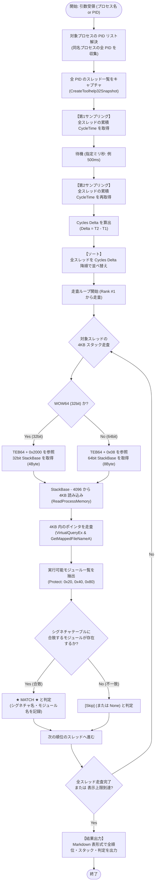

# テストスクリプト仕様書: 汎用プロセス・スレッド物理監査ツール (`testspec.md`)

本書は、対象プロセスの全スレッドの物理特性（Cycles Delta、優先度、スタック状態、参照モジュール）を統一的に取得・可視化し、オーディオスレッドの特定精度を検証するための単一テストスクリプト（`audit_process.py`）の仕様書である。

---

## 0. Chat: 最初から C# で作り直す検討 (C++ vs C# 比較)

### Q. 最初から C# で作り直すのは メリットある？

### A. 物理的な観点からの客観的比較

#### 1. C# で作り直すメリット
1. **開発効率とコードの短縮（特に GUI）**:
   - 現在 `main.cpp`（約 2,570 行）で実装している Win32 GDI の描画処理（ListView のゼブラストライプ、インプレース ComboBox、DPI スケーリング、動的リサイズ）が、WPF や WinForms を使えばデータバインディングにより数百行程度で記述可能。
2. **コレクション操作と LINQ**:
   - `audit_process.py` で実現している「Cycles Delta でソートし、上から順にフィルタリングする」処理が、LINQ（`threads.OrderByDescending(t => t.Delta)`）により極めて短く安全に記述可能。
3. **メモリ管理の安全性**:
   - 生ポインタの取り違えやメモリリークの危険性が低減。

#### 2. C# で作り直すデメリット・物理的制約
1. **実行ファイルの肥大化とランタイム依存**:
   - 現在の C++ 実装は **外部ランタイム不要の単一実行ファイル（約 1.2 MB）** で動作し、どの Windows 10/11 環境でも即座に起動。
   - C#（最新の .NET 8 / 9）で単一 exe（Self-Contained）を生成すると、ランタイムが内包されるため exe サイズが **50 MB 〜 70 MB** に跳ね上がる。
   - ランタイム非同梱（Framework-Dependent）にした場合は、ユーザー環境に特定の .NET Desktop Runtime がインストールされている必要がある。
2. **メモリ消費量（ワーキングセット）の増加**:
   - C++ 版の ATI はメモリ消費が **数 MB 程度** であるのに対し、C# では CLR（ガベージコレクタ）が常駐するため、起動直後から **30 MB 〜 60 MB 前後** を消費。
3. **低レイヤ処理における P/Invoke の記述量**:
   - `ReadProcessMemory`、`VirtualQueryEx`、TEB32 構造体のオフセット計算など、Win32 ネイティブ API を多用する箇所では、C# 側で大量の P/Invoke シグネチャ（`DllImport`）と `unsafe` 構造体の定義が必要となり、この部分に限っては C++ より記述量が増加。
4. **既存機能の再実装コスト**:
   - 既に稼働している CPU トポロジー判定（E-Core/P-Core 判別）、アフィニティマスク制御、INI 永続化、システムトレイ常駐、Restart 制御などをすべて C# で書き直す工数が発生。

#### 3. 総合比較テーブル

| 評価軸 | C++ (現行ベース + 判定部刷新) | C# (全面ゼロベース再構築) |
| :--- | :--- | :--- |
| **単一 exe サイズ** | **約 1.2 MB** (極小) | **50 MB 〜 70 MB** (Self-Contained時) |
| **外部ランタイム依存** | **なし** (OS 標準 DLL のみ) | あり (またはランタイム内包) |
| **メモリ使用量** | **約 3 〜 5 MB** | **約 30 〜 60 MB** |
| **GUI 実装コスト** | 既存コード (`main.cpp`) を維持 | WPF 等で新規作成（短行化可能） |
| **スレッド判定コアの移植** | `audit_process.py` を C++ に直移植 | `audit_process.py` を C# に直移植 |
| **工数** | **最小**（`isolator.cpp` 判定部の刷新のみ） | **大**（全モジュールの再構築） |

#### 4. まとめ
- **「1.2 MB・依存関係なし・低メモリ常駐」という ATI 本来の軽量スタンドアロン性を最優先する場合**:
  - 既存の GUI やインフラ（`main.cpp` 等）を維持し、**`isolator.cpp` の判定コア部分のみを `audit_process.py` のアルゴリズムにゼロベース刷新するアプローチが最短かつ効果的**。
- **「C++ の Win32 GUI メンテナンスから解放され、GUI をモダンに再構築したい場合」**:
  - C# への移行は開発保守性の面でメリットがある。

---

> ### 【MEMO】Process Explorer (`procex64.exe`) で見えないオーディオモジュールが本監査で見える物理的理由
> 
> 1. **Process Explorer (`procex64.exe`) のアプローチ: コールスタック・アンワインド**
>    - Windows のデバッグ API（`StackWalk64` や `RtlVirtualUnwind`）を用い、現在の RSP（スタックポインタ）からリターンアドレスの連鎖を辿る**論理的な呼び出し履歴の復元**を行う。
>    - スレッドが待機状態に入ると、カーネル（ドライバや `NtWaitForSingleObject` 等）へ遷移した時点でスタックフレームが固定される。直前に呼び出していた `audioses.dll` 等の関数処理はすでにリターン（終了）しているため、アンワインドチェインから外れて画面上には現れなくなる。
>    - Chromium 系ブラウザのように非公開シンボルの場合、`IsSandboxedProcess + オフセット` 等の大雑把なシンボルに集約され、内部の細かい呼び出し先がスキップされる。
> 
> 2. **本監査ツール (`audit_process.py` / ATI) のアプローチ: 物理 4KB スタックスキャン**
>    - コールスタックの連鎖（アンワインド）を辿るのではなく、スレッドスタックの物理メモリ領域（`StackBase - 4096`）から **4KB のバイト列そのものを `ReadProcessMemory` で直接取得**する。
>    - オーディオスレッドは定期的な音声バッファ転送や同期のために `audioses.dll` の COM メソッド等を頻繁に呼び出している。関数処理からリターンした後であっても、ローカル変数、オブジェクトの vtable ポインタ、直近のリターンアドレス等として、**`audioses.dll` の実行可能コード領域（`PAGE_EXECUTE`）を指す 64bit/32bit ポインタがスタックメモリ上に物理的に残存（フットプリント）** している。
>    - 本監査ツールは 4KB スタック内の全ポインタ値を `VirtualQueryEx` で走査して所属モジュールを判定するため、Process Explorer の論理アンワインドでは見えなくなっているオーディオモジュールを確実に捕捉できる。

---

## 1. 趣旨 (Purpose & Objectives)

### 1.1 背景
オーディオスレッドの特定ロジックを検証するにあたり、対象アプリケーション（Chromium, Spotify, Sleipnir, 各種プレイヤー, ゲーム等）ごとに個別の使い捨てスクリプトを作成すると、測定条件のばらつきやマッピング不整合による誤認を招く。
同一の測定手順・同一の出力形式で対象プロセスの全スレッドを横断評価できる単一の堅牢な監査基盤が必要である。

### 1.2 目的
プロセス名（または PID）を単一の引数として受け取り、マルチプロセスを含む全スレッドの物理特性をキャプチャして、**「Cycles Delta 降順ソート ➔ 上位から順に 4KB スタック走査 ➔ オーディオシグネチャ合致の判定」** を客観的な表形式で出力する。
本ツールは「フォールバックによる推測採用」を行わず、シグネチャの検出有無と物理パラメータをありのまま可視化することを目的とする。

---

## 2. 機能仕様 (Functional Specifications)

### 2.1 コマンドライン引数インターフェース
```bash
python audit_process.py <Target> [Options]
```

- **`<Target>` (必須)**:
  - プロセス名（拡張子有無不問、例: `Spotify`, `chrome`, `Sleipnir.exe`）
  - または PID（数値、例: `13876`）
- **`[Options]`**:
  - `--interval <ms>`: Cycles Delta 計測サンプリング間隔（ミリ秒、デフォルト: `500`）
  - `--top <N>`: 結果表示件数の上限（デフォルト: `20`、または検出スレッドを含む全件）
  - `--all-pids`: 同名プロセスの全 PID を横断走査（デフォルト: 有効）
  - `--verbose`: 各スレッドのコールスタック（RSP からの呼び出し履歴）を詳細ダンプ

### 2.2 取得・測定データ項目

| 項目分類 | フィールド名 | 取得 API / 手法 | 説明 |
| :--- | :--- | :--- | :--- |
| **プロセス情報** | `PID` | `CreateToolhelp32Snapshot` | 対象プロセスの ID |
| | `ProcessName` | `GetProcessImageFileName` / `QueryFullProcessImageName` | 実行ファイル名 |
| | `Arch` | `IsWow64Process` | `x64` または `WOW64` (32bit) |
| **スレッド情報** | `TID` | `THREADENTRY32.th32ThreadID` | 対象スレッドの ID |
| | `BasePriority` | `NtQueryInformationThread(ThreadBasicInformation)` | 基本優先度（Normal: 8, ProAudio: 15/16 等） |
| | `PriorityLevel` | `GetThreadPriority` | 優先度オフセット（-15 〜 +15） |
| **サイクル消費量** | `Cycles_T1` | `QueryThreadCycleTime` (1回目) | 計測開始時の累積 CPU サイクル |
| | `Cycles_T2` | `QueryThreadCycleTime` (2回目) | 計測終了時の累積 CPU サイクル |
| | **`Cycles_Delta`** | `Cycles_T2 - Cycles_T1` | **ソート第 1 キー（降順）** |
| **スタック物理状態** | `TEB_Base` | `THREAD_BASIC_INFORMATION.TebBaseAddress` | 64bit TEB のベースアドレス |
| | `TEB32_Base` | `TEB_Base + 0x2000` (WOW64時) | 32bit TEB のベースアドレス |
| | `StackBase` | TEB 内オフセット（x64: +8, 32bit: +4） | スタック上限アドレス |
| | `ScanAddr` | `StackBase - 4096` | 4KB 安全読み込み開始アドレス |
| **モジュール走査** | `ModulesIn4KB` | `ReadProcessMemory` (4KB) ➔ `VirtualQueryEx` ➔ `GetMappedFileNameA` | 4KB スタック内に存在する実行可能モジュール群 |
| | **`AudioSignature`** | 下記シグネチャテーブルとの照合結果 | 検出されたオーディオ API / モジュール名 |
| **判定総合結果** | **`Verdict`** | **照合判定結果** | `[★ MATCH ★]` または `[Skip]` / `[None]` |

### 2.3 オーディオ検出シグネチャ定義テーブル

4KB スタック内のポインタから逆引きしたモジュール名（小文字比較）に対し、以下のシグネチャと照合する。

| 区分 | 対象モジュール名（シグネチャ） | 役割・API | 該当アプリケーション例 |
| :--- | :--- | :--- | :--- |
| **WASAPI** | **`audioses.dll`** | Windows Audio Session API クライアント | Spotify, Chromium 系ブラウザ, 各種現代メディアプレイヤー |
| **DirectSound** | **`dsound.dll`** | DirectSound 再生バッファ・ミキサー | 各種レガシー PC ゲーム, DirectSound 出力プレイヤー |
| **XAudio2** | **`xaudio2_9.dll`**<br/>**`xaudio2_8.dll`**<br/>**`xaudio2_7.dll`** | DirectX XAudio2 オーディオエンジン | 各種 3D/2D PC ゲーム, Unreal Engine, Godot |
| **ASIO** | **`*asio*.dll`**<br/>(例: `asio4all*.dll`, 各種オーディオIFドライバ) | ASIO ドライバ直接転送 | foobar2000, 各種 DAW ソフトウェア |
| **MME / WaveOut** | **`wdmaud.drv`**<br/>**`winmm.dll`** | レガシー Windows マルチメディア API | レガシー音楽プレイヤー, 簡易通知音再生 |
| **OpenAL** | **`openal32.dll`**<br/>**`soft_oal.dll`** | OpenAL 3D オーディオライブラリ | 各種インディーゲーム, エミュレータ |
| **ミドルウェア・独自** | **`fmod*.dll`** (`fmod.dll`, `fmodstudio.dll`) | FMOD サウンドシステム | Unity 製ゲーム, 商業 PC ゲーム |
| | **`bass.dll`** | BASS Audio Library | 各種カスタムプレイヤー, 同人ゲーム |
| | **`pxtone*.dll`** (`pxtoneWin32.dll`) | Pxtone 独自合成エンジン | `hanano2.exe` 等のインディー作品 |

### 2.4 単一オーディオスレッド確定仕様 (Primary Audio Thread Arbitration)

複数のオーディオスレッド（シグネチャ合致 かつ `Cycles Delta > 5M/s`）が同時に検出された場合、以下の優先判定ルールに従って孤立対象となる単一の「確定オーディオスレッド (Primary Audio Thread)」を確定する。

1. **WASAPI & DirectSound 共存時**:
   - `WASAPI` (`audioses.dll`) と `DirectSound` (`dsound.dll`) のスレッドが両方検出された場合、**`WASAPI` 側のスレッドに確定**する。
   - （背景: Windows 10/11 上では DirectSound は WASAPI バックエンド上で動作しており、最終的な物理オーディオエンドポイントへの送出を担っているのは WASAPI スレッドであるため）
   - ※ WASAPI スレッドが複数ある場合は、WASAPI スレッド群の中で `Cycles Delta` 最上位を採用。
2. **その他の場合**:
   - 上記共存時以外（単一 API 種別のみ、または他の組み合わせ等）は、検出された全オーディオスレッドの中で **`Cycles Delta` 最上位のスレッドに確定**する。
3. **表示ハイライト仕様**:
   - コンソール出力時、確定したスレッドの **`PID` および `TID` を赤色（ANSI エスケープカラー）でハイライト表示**する。

---

## 3. 処理フローチャート (Flowchart)



---

## 4. 物理的な注意点と実装要件 (Engineering Requirements)

### 4.1 WOW64 (32bit) プロセスの TEB・スタック構造
- **64bit TEB の回避**: 64bit Windows 上の 32bit プロセスに対して `NtQueryInformationThread` を呼ぶと 64bit TEB (`TEB64`) が返る。このスタックには WOW64 移行サブシステム（`wow64.dll` 等）しか存在しない。
- **32bit TEB へのアクセス**: `TEB64 + 0x2000` から 32bit TEB を読み取り、オフセット `+4` の `StackBase32`（4 バイト）を取得する。
- **走査アライメント**: 32bit スタック内のポインタ走査は **4 バイト単位** で行う。

### 4.2 スタック読み込み境界（デマンドコミット対応）
- **エラー 299 の防止**: スレッドスタックは動的にコミットされるため、未コミット領域を跨いで 32KB 等を一括読み込みすると `ERROR_PARTIAL_COPY` (エラー 299) で失敗する。
- **4KB 固定読み込み**: 最も直近のアクティブなフレームが存在する `StackBase - 4096` の 1 ページ（4096 バイト）のみを読み込むことで、エラー 299 を起こさずに確実に捕捉する。

### 4.3 メモリ保護属性 (Protect Flags)
- コードポインタを判定する際、`PAGE_EXECUTE_READ` (0x20) および `PAGE_EXECUTE_READWRITE` (0x40) に加え、DLL 再配置やフック等で発生する **`PAGE_EXECUTE_WRITECOPY` (0x80)** も実行可能属性として許容する。

### 4.4 Cycles Delta 測定間隔と常駐実装の差異
- **ワンショットツール（Python）**:
  - `QueryThreadCycleTime` は通算累積サイクル数を返すため、Delta 算出には 2 点間の計測待機（500ms）が必要となる。全体の実行時間は約 0.55〜0.60 秒となる。
- **常駐監視（C++ / ATI.exe）**:
  - 常駐ループ（500ms 周期）内で前回のサイクル値を保持しているため、追加の待ち時間（Sleep）は不要。差分の引き算は 1 回あたり数ナノ秒で完了し、100 スレッド全体の走査も 0.5 ミリ秒以下で完了する。

---

## 5. 出力フォーマット仕様

スクリプト実行時、以下の Markdown 表形式で一貫した出力を生成する。

```text
Target Process: Spotify (PIDs: 13876, 18944, 32984) | Sampling Interval: 500ms
Architecture: x64 | Total Threads Scanned: 91

Rank | PID   | TID   | Cycles Delta | Priority | Verdict    | Audio Signature       | Modules in 4KB Stack
-----+-------+-------+--------------+----------+------------+-----------------------+------------------------------------------------
 #1  | 13876 | 27936 |   15,264,900 | Normal   | [Skip]     | (none)                | spotify.dll, kernel32.dll, ntdll.dll
 #2  | 13876 | 11408 |    4,539,150 | Normal   | [Skip]     | (none)                | spotify.dll, nvlddmkm.sys, kernel32.dll
 #3  | 13876 | 13108 |    3,364,200 | Pri:10   | [★ MATCH ★]| WASAPI (audioses.dll) | audioses.dll, spotify.dll, rpcrt4.dll, ntdll.dll
 #4  | 13876 |  4860 |    3,057,950 | Normal   | [Skip]     | (none)                | spotify.dll, spotify.exe, kernel32.dll
...
-----+-------+-------+--------------+----------+------------+-----------------------+------------------------------------------------
Detection: 1 audio thread(s) matched signature table.
```
