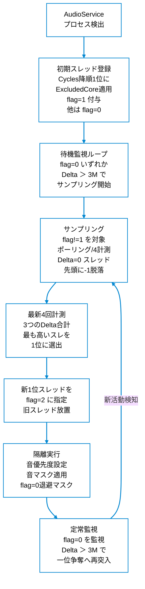

# Chromium (Type 2) 音声スレッド判定＆隔離フロー仕様書

Chromium（AppType: 2）におけるスレッド選定・サンプリング判定・隔離処理の改修後フローを記録します。

---

## 1. 処理フロー図

---

## 2. 確定仕様の物理的事実

| 処理区分 | 判定内容・動作 | 実機での具体値・備考 |
| :--- | :--- | :--- |
| **初期登録** | **CycleTime（総サイクル数）の降順 1 位（`cycleInfos[0]`）に Excluded CPU# を適用し、`flag = 1`（親制御スレッド・恒久除外）を付与**。他は `flag = 0`。 ※ TEB アドレス比較は廃止。 | PID検出時: 200M前後（2位の30倍以上）の制御スレッドに Excluded マスクを適用して除外 |
| **待機・契機** | **当該 PID 内の `flag == 0` のスレッドのいずれかが**、`defaultcyclesdelta`（INI設定値、現在 3M）< Delta を満たした時にサンプリング開始。 **サンプリング対象は `flag = 1` 以外の全スレッド（`flag == 0` および `flag == 2`）**。 | 音声再生開始や新スレッドの活動を検知 |
| **サンプリング** | **ポーリング/4（通常周期 500ms 時は 125ms）間隔** で 3 回 Delta を計測・加算（計 375ms）。 **計測中に `Delta == 0` となったスレッドは配列先頭 `d[t].deltas[0]` に `-1` を上書きして脱落マーク**。 ※ サンプリング中もメインウィンドウの表示は `PID xxxx / Searching...` を維持（短時間でのチラつき防止）。 | 一時的バーストや停止した候補を除外 |
| **上位選出 (新旧比較廃案)** | 脱落（`-1`）していないスレッドを対象に、**ポーリング/4 間隔で計測した「最新 4 つの計測における 3 つの Delta の合計値」が最も高いスレッドを上位 1 位として選出**。 ※ 従来の新旧 Delta 比較ロジックは**全て廃案**。3 回の計測（3 区間 = 375ms）による 3 つの Delta 合計が最高のスレッドが無条件に勝利。 | 最新 4 計測（起点+3回）の 3 Delta 合計最大スレッドが選定される |
| **オーディオ確定** | 選出されたスレッドを真のオーディオスレッドとして **`flag = 2`** に指定（旧 `flag = 2` スレッドは放置）。 | 勝者スレッド ➔ `flag = 2` |
| **隔離適用** | `flag = 2` に `rule.audioPriority`（INI 設定値 例：`-15`）および `audioMask`（例：Core 11）を適用。**`flag = 0` は `normalMask` へ退避**（`flag = 1` 除外スレッドは変更しない）。 | 例：TID 14720 ➔ Core 11 / Idle (-15) |
| **定常監視** | 確定後も `flag == 0` を監視。`defaultcyclesdelta`（INI設定値、現在 3M）< Delta の活動を検知した場合は再度サンプリングを行い一位争奪へ突入。（変更なし） | 自律的な世代交代・エフェメラル追随 |
